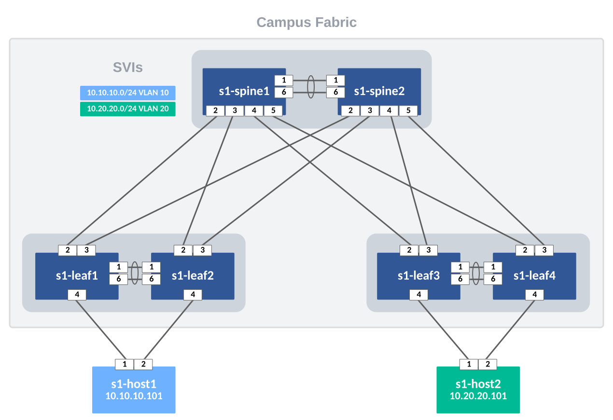
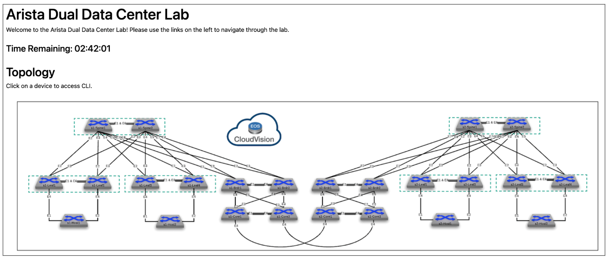

# ATD AVD - L2LS CAMPUS

This repository builds a L2LS Campus fabric on the Dual Data Center ATD Lab. The below diagram respresents a single Campus Fabric within the larger Lab topology. Using AVD, we will build and deploy configurations for the 2 spines and 2 leaf pairs.  In addition we will explore adding port configurations to support 802.1x NAC features.



## Requirements

- Start the Dual Data Center ATD Lab



## Summary of Steps

1. [Launch Programmability IDE](#step-1---launch-programmability-ide)
2. [Clone Repository to Lab IDE](#step-2---clone-repository-to-lab-ide)
3. [Update AVD to Latest Version](#step-3---update-avd-to-latest-version)
4. [Set Lab Password environment variable](#step-4---set-lab-password-environment-variable)
5. [Build Configs](#step-5---build-configs)
6. [Deploy Configs](#step-6---deploy-configs)
7. [Test Traffic](#step-7---test-traffic)
8. [Network Ports and 802.1x Port Profiles](#step-8-optional---network-ports-and-8021x-port-profiles)

## STEP #1 - Launch Programmability IDE

- Launch the Progammability IDE.  If this is the first time starting the IDE you will be prompted for a code-server password.  Your unique password is noted on the Lab Topology page.


- Click through any pop-ups that may occur.
- Start a new terminal session by clicking on the hamburger and selecting Terminal->New Terminal.


## STEP #2 - Clone Repository to Lab IDE

- Change into `labfiles` sub-directory.  From here, clone the repo and change into directory. Remaining commands will be executed from here.

``` bash
cd /home/coder/project/labfiles
git clone https://github.com/PacketAnglers/atd-avd-l2ls-campus.git
cd atd-avd-l2ls-campus
```

## STEP #3 - Update AVD to Latest Version

- From the terminal session, run the following commands.

``` bash
ansible-galaxy collection install arista.avd arista.cvp --force
export ARISTA_AVD_DIR=$(ansible-galaxy collection list arista.avd --format yaml | head -1 | cut -d: -f1)
pip3 config set global.disable-pip-version-check true
pip3 install -r ${ARISTA_AVD_DIR}/arista/avd/requirements.txt
```

## STEP #4 - Set Lab Password environment variable

The following command sets the environment variable LABPASSPHRASE which is used later for connecting to your lab switches and creating local user password.

``` bash
export LABPASSPHRASE=`cat /home/coder/.config/code-server/config.yaml| grep "password:" | awk '{print $2}'`
```

## STEP #5 - Build Configs

From the terminal window, run the command below to execute an ansible playbook and build the AVD generated configurations and store them in a local directory `intended/configs`.

``` bash
make build
```

> This command executes the following: `ansible-playbook playbooks/build.yml`

## STEP #6 - Deploy Configs

Use one of the two methods below to deploy your configurations to your switches.

### Method #1 - eAPI Direct switch (~28 secs)

This playbook uses Arista's eAPI & eos_config module to do a config replacement of the switch's running_config.

``` bash
make deploy
```

### Method #2 - CVP (~6 mins)

This playbook uses Arista's AVD Galaxy collection to deploy configurations via CVP.  Login to CVP to watch what happens while the playbook runs.

It does the following:

1. Creates configlets and pushes them to CVP
2. Creates a container topology based on inventory groups
3. Moves devices to container
4. Attaches configlets to devices
5. Creates Tasks

> You will need to create a Change Control in CVP to execute the tasks.  This can be automated by setting `execute_tasks: true` in the playbook `deploy-cvp.yml`.

``` bash
make deploy-cvp
```

## STEP #7 - Test Traffic

Connect to `s1-host1` and ping `s1-host2`

``` bash
ping 10.20.20.101
```

## STEP #8 (Optional) - Network Ports and 802.1x Port Profiles

 In a Campus environment, we typically configure a range of ports within a leaf switch to have the same charactestics (vlan, mode, portfast, NAC, etc...).  AVD provides a way to define a **Port Profile** and then apply it to a range of ports on multiple switches.

### Typical Campus Port Configuration

``` bash
interface EthernetX
   switchport trunk native vlan 10
   switchport phone vlan 15
   switchport phone trunk untagged
   switchport mode trunk phone
   switchport
   dot1x pae authenticator
   dot1x authentication failure action traffic allow vlan 999
   dot1x reauthentication
   dot1x port-control auto
   dot1x host-mode multi-host authenticated
   dot1x mac based authentication
   dot1x timeout tx-period 3
   dot1x timeout reauth-period server
   dot1x reauthorization request limit 3
   spanning-tree portfast
   spanning-tree bpduguard enable
```

To configure ports Ethernet7-48 on all four leaf switches with the above configuration, open file `group_vars/ATD_FABRIC_PORTS.yml`  and uncomment lines 25-57.

``` yaml
network_ports:

# # ---------------- s1-leaf1/2 ----------------

#   - switches:
#       - s1-leaf[12] # regex match s1-leaf1 & s1-leaf2
#     switch_ports:
#       - Ethernet7-48
#     profile: PP-DOT1X
#     native_vlan: 10
#     structured_config:
#       phone:
#         trunk: untagged
#         vlan: 15
#     dot1x:
#       authentication_failure:
#         action: allow
#         allow_vlan: 999

# # ---------------- s1-leaf3/4 ----------------

#   - switches:
#       - s1-leaf[34] # regex match s1-leaf3 & s1-leaf4
#     switch_ports:
#       - Ethernet7-48
#     profile: PP-DOT1X
#     native_vlan: 20
#     structured_config:
#       phone:
#         trunk: untagged
#         vlan: 25
#     dot1x:
#       authentication_failure:
#         action: allow
#         allow_vlan: 999
```

- Modify the switch configurations with the additional ports (Ethernmet7-48) by running the following command.

``` bash
make build
```

View updated configs in `intended/configs`.

> Note: You will not be able to deploy these configs as those ports do not exist on your virtual lab switches.
