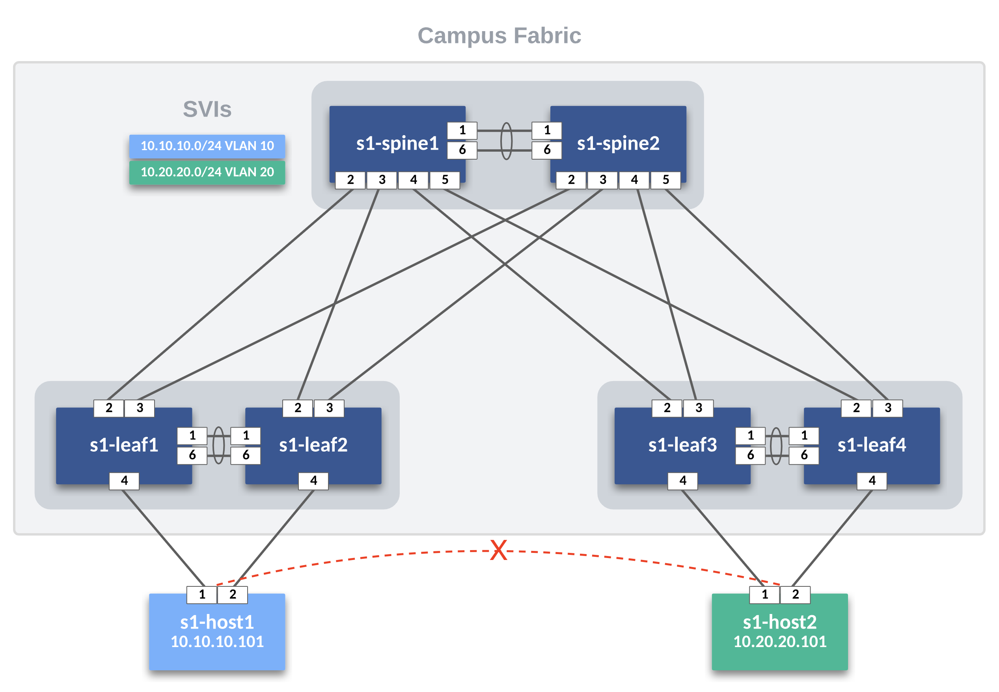
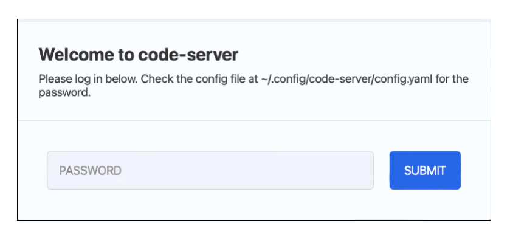

# Back To Basics ATD - Troubleshooting Scenario

This repository provides a troubleshooting scenario that may arise in an enterprise environment.  The topology is a L2LS Campus fabric built on the Dual Data Center ATD Lab. For the purposes of this troubleshooting scenario we will be focusing on site1.



## Scenario

You have arrived to the office on Monday morning to find that a change has been made and s1-host1 is no longer able to reach s1-host2.  The hosts (s1-host1 and s1-host) reside in vlans 10 and 20, respectively. SVIs have been created on the hosts within their respective VLANs and a static route has been configured to provide reachability between the two VLANs. If you need additional information or assistance please ask your ATD SE.  Thank you and good luck!

## Summary of Steps to Deploy Scenario

1. [Launch Programmability IDE](#step-1---launch-programmability-ide)
2. [Clone Repository to Lab IDE](#step-2---clone-repository-to-lab-ide)
3. [Setup the Troubleshooting Lab Environment](#step-3---setup-the-troubleshooting-lab-environment)
4. [Deploy Configs](#step-4---deploy-configs)
5. [Begin Scenario](#step-5---begin-scenario)

## STEP #1 - Launch Programmability IDE

- Launch the Progammability IDE.  If this is the first time starting the IDE you will be prompted for a code-server password.  Your unique password is noted on the Lab Topology page.



- Click through any pop-ups that may occur.
- Start a new terminal session by clicking on the hamburger and selecting Terminal->New Terminal.


## STEP #2 - Clone Repository to Lab IDE

- Change into `labfiles` sub-directory.  From here, clone the repo and change into directory. Remaining commands will be executed from here.

``` bash
cd /home/coder/project/labfiles
git clone https://github.com/hazardsg/atd-b2b-tshoot.git
cd atd-b2b-tshoot
```

## STEP #3 - Setup the Troubleshooting Lab Environment

- From the terminal session, run the following command.

``` bash
make install
```

## STEP #4 - Deploy Configs

To deploy the troubleshooting lab directly to the switches , run the following command: (In CVP the configs will be out of compliance)  

``` bash
make deploy-scenario
```

To deploy the troubleshooting lab using CloudVision, run the following command: (In CVP the the changes can be rolled back via change control)

``` bash
make deploy-scenario-cvp
```

To reset the troubleshooting lab to the correct configuration/solution, run the following command:

``` bash
make deploy-fixes
```

## STEP #5 - Begin Scenario

Begin troubleshooting!
